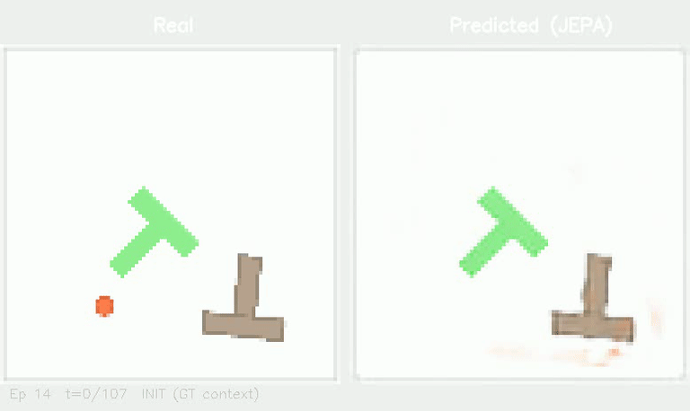
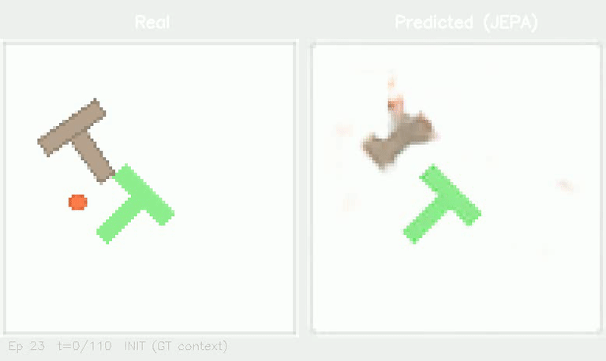
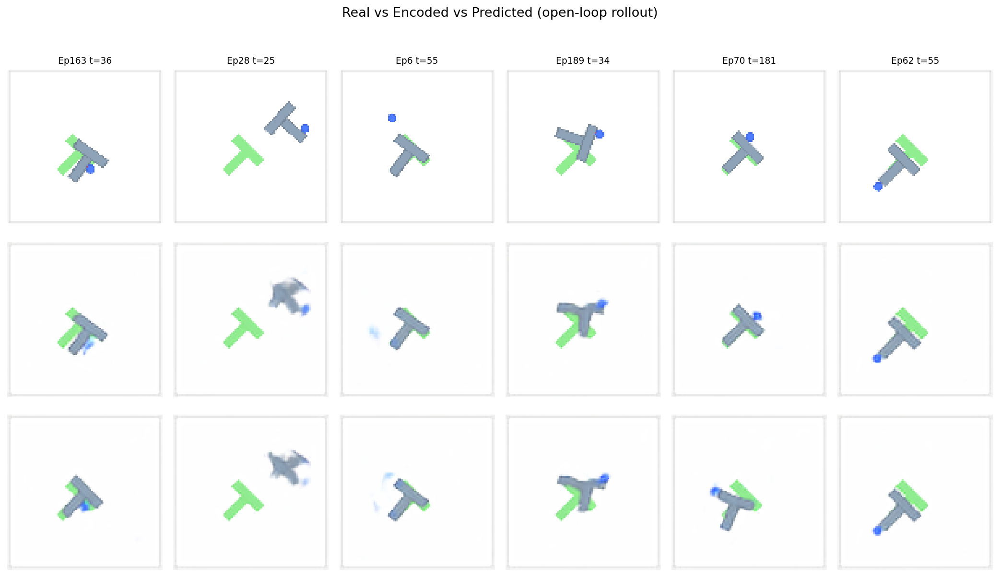

<div align="center">

# jwm-pusht

[](https://pytorch.org)
[](https://arxiv.org/abs/2301.08243)
[](https://arxiv.org/abs/2603.19312)
[](https://huggingface.co/datasets/quentinll/lewm-pusht)

</div>

---

## Motivation

JEPA currently is a new architecture, that is actively being researched on. While going through recent papers, I stumbled upon [LeWorldModel](https://arxiv.org/abs/2603.19312). It's very interesting to think about how AdaLN-Zero conditioning lets actions steer the predictor through latent space where the model internally learns to "simulate" actions affect the world state, effectively capturing the dynamics of a physical pushing task. It's interesting to think about the practical implications of such models.

---

## 1. First attempt - Colab (failed)

I started small: fewer epochs, smaller batch sizes, free Colab GPU. The loss moved but the latents collapsed, the model predicted boring averages. Learned that SIGReg alone needs enough batch diversity and compute to hold. Colab runtime disconnects didn't help either.

## 2. Second attempt - L4 on GCP

Rented a GCP VM with an NVIDIA L4 GPU, 24 GB VRAM. Trained for 100 epochs at batch size 128 on the full PushT dataset. ViT-Tiny encoder (12 layers, 192D), causal transformer predictor (6 blocks, AdaLN-Zero), and two decoders to visualise what the latent space had learnt.

This time it worked.

| Metric | Value |
|--------|-------|
| Encoder params | ~5.7M |
| Predictor params | ~12M |
| Total | ~18M |
| Latent collapse | No |

## 3. Results

### Open-loop rollouts

<p align="center">
  
  <br/><em>Episode 14 (Left): Real, Right: Predicted (JEPA).</em>
</p>

<p align="center">
  
  <br/><em>Episode 23 (Same Format). 3 init frames, then autoregressive rollout.</em>
</p>

### Random samples across episodes

<p align="center">
  
</p>

*Top: Real. Middle: Decoded from encoded latent. Bottom: Decoded from predicted latent (open-loop rollout). All frames are deep into the prediction horizon, not init frames.*

## 4. Reproduction

### 1. Clone

```bash
git clone https://github.com/hammrlord/jwm_pusht
cd jwm-pusht
```

### 2. Get the data

Download `pusht_cchi_v7_replay.zarr` from the [Lewm Huggingface](https://huggingface.co/datasets/quentinll/lewm-pusht) and place it in `data/pusht/`.

### 3. Install

```bash
pip install -r requirements.txt
```

### 4. Train

```bash
python3 run.py
```

This runs the full pipeline: world model training, latent evaluation, decoder training, decoder evaluation. Edit `config.py` to change hyperparameters.

### 5. Inference / rollout videos

```bash
python3 make_video.py
```

Outputs side-by-side comparison videos to `media/`.

### 6. Load pretrained weights

```python
from jwm_pusht.config import Config
from jwm_pusht.training.trainer import build_model

cfg = Config()
model = build_model(cfg)
model.load_state_dict(torch.load("checkpoints/world_model_best.pt"))
model.eval()

z = model.encode_single(frames)  # (B, 192)
all_z = model.rollout(init_imgs, init_actions, future_actions)
```

## 5. Project structure

```
├── config.py                     # All hyperparameters in a dataclass
├── run.py                        # Single entrypoint: train, eval, decode
├── make_video.py                 # Episode rollout video renderer
├── models/
│   ├── encoder.py                # ViT-Tiny + ProjectionMLP + ActionEmbedder
│   ├── predictor.py              # ARPredictor (transformer) + LSTMPredictor
│   ├── world_model.py            # LeWorldModel: encode, predict, rollout
│   ├── decoder.py                # PatchTokenDecoder + LatentDecoder + LPIPS
│   └── sigreg.py                 # SIGReg regulariser
├── data/
│   └── dataset.py                # PushT zarr dataset + DataLoader builder
├── training/
│   ├── trainer.py                # World model training loop
│   └── decoder_trainer.py        # Decoder training loops
├── evaluation/
│   ├── latent_eval.py            # PCA trajectory + latent distribution plots
│   └── decoder_eval.py           # 4-row reconstruction comparison grid
├── utils/
│   └── plotting.py               # Training curve plots
├── checkpoints/                  # Trained weights
└── media/                        # Output videos and plots
```

## 6. What didn't work

- Smaller ViT (fewer layers / smaller hidden dim): predictor underfit, blurry rollouts
- Training without SIGReg: immediate collapse within 5 epochs
- ConvTranspose in the decoder: checkerboard artefacts (switched to Upsample+Conv)
- Running on free Colab GPU: OOM, disconnects, not enough batch diversity for SIGReg

---

<div align="center">
  <sub>Built by Kartik Sharma - June 2026</sub>
</div>
